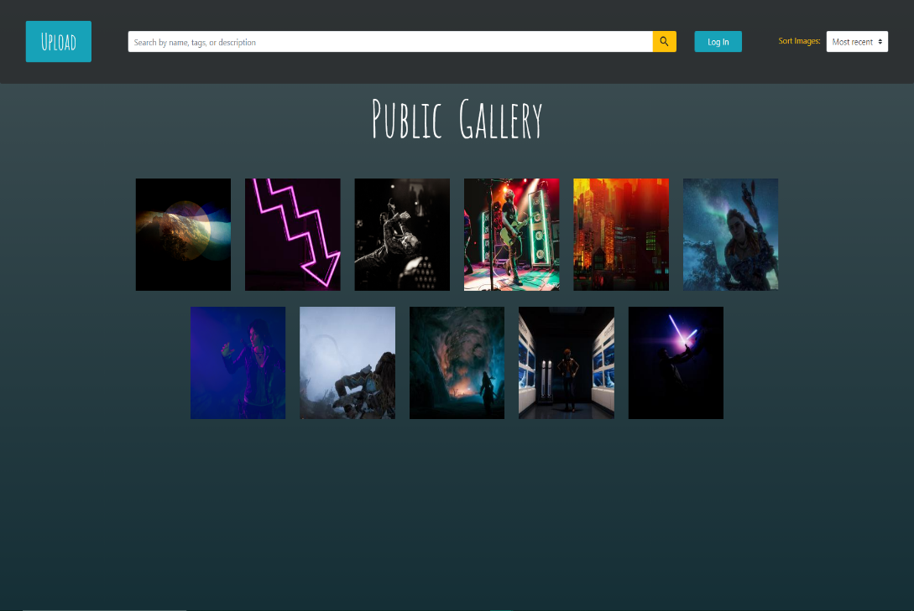

### Website written in HTML, CSS, JavaScript, and PHP to submit, edit, and delete photos in a gallery view.

see the demo [here](https://drive.google.com/file/d/1Og7YK43sHVNgtC0_UbgxDKwBXY_T70Mb/view?usp=sharing)

header.inc
 - HTML header for all .inc files
 - links to form.js, bootstrap.min.css, jquery-3.4.1.min.js, 
    'Amatic' Google Font, 'Material Icons' Google Font
 - onload to get JSON when on gallery pages echoed by PHP

form.inc
 - image upload form
 -  errors displayed with PHP echo

pubhome.inc
 - public gallery view
 - only has public JSON/images
 - can search and sort
 - can search by pressing 'ENTER' key & clear search results by pressing 'x' in search bar

modhome.inc
 - moderator gallery view
 - has search, sort, public/private filtering, and edit views
 - can search by pressing 'ENTER' key & clear search results by pressing 'x' in search bar
approval.inc
 - awaiting approval moderator view
 - has search, sort, public/private filtering, and photo approval
 - can search by pressing 'ENTER' key & clear search results by pressing 'x' in search bar

footer.inc
 -  end of all .inc files, just closing tags of body and HTML

style.css
 - All styling (with the exception of Bootstrap classes
    & JavaScript modifications) for HTML
 - validates (there was a typo but that is fixed)

index.php
 - public gallery (home page)
 - handles form input.error checking, file upload, & thumbnail generation
 - handles differentiating editors and non-editors (with session variables)
 - echos thumbnails into HTML (with the image's description as it's alt attribute)
 - handles changing/displaying different pages
 
approve.php
 - approves image(s) in JavaScript array (using ajax call)
    images in array are selected by user

delete.php
 - deletes image(s) in JavaScript array (using ajax call)
    images in array are selected by user
    
downloadimg.php
 - downloads image in lightbox view for moderator
 
zipall.php
 - packs all uploaded images into zip file & sends it for download

galleryinfo.php
 - gets JSON to JavaScript using echo
 - filters JSON based on what page user in on
    only public JSON sent to JavaScript if in public gallery

submit.php
 - update 'galleryinfo.json' with edited information
 - used in both lightbox and edit all views
 
form.js
 - handles functionality that does not need to be server side (server-side abilities explained above)
    this includes search, sort, filter, css changes, lightbox display, approving images,
 - makes ajax calls to load, delete, and change JSON
 - Makes ajax calls to download one or all images
 
*Previous/next arrows and x button in the lightbox were all taken from my (Trista's) grade 9 website, and are public domain.
